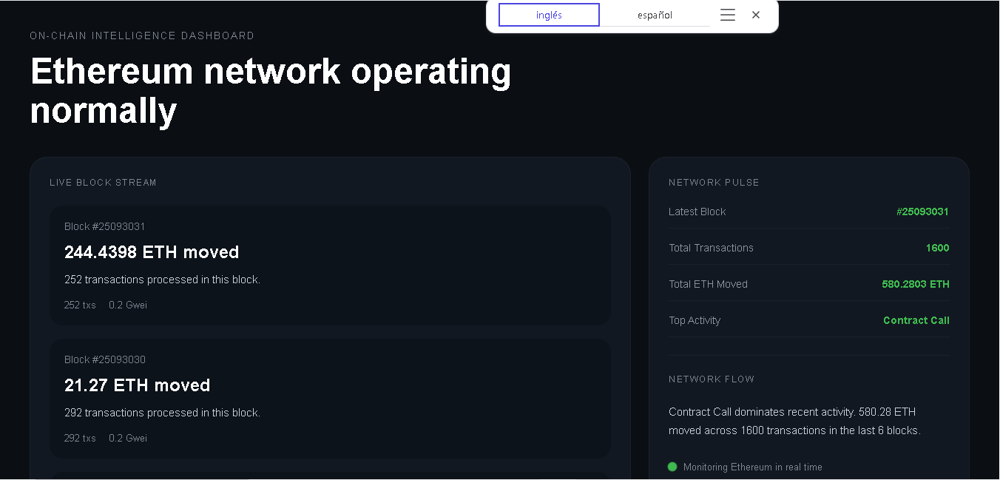

# On-Chain Intelligence Dashboard

A functional, real-time analytics dashboard monitoring live block streams, gas fees (Gwei base fees), volume tracking, and network activity distribution on Ethereum Mainnet.

## Demo

🔗 **Live Demo:** [https://onchain-intelligence-dashboard.onrender.com](https://onchain-intelligence-dashboard.onrender.com)

## Problem

Raw block explorers like Etherscan are optimal for isolated inquiries but fail to give a micro-analytical view of instantaneous network behavior. Tracking macroeconomic metrics like transaction type dominance, sudden gas price spikes, and volume velocity requires consolidated visual monitoring planes. 

## Features

- **Live Block Stream:** Renders processed blocks dynamically as they hit the chain, logging volume metrics and transaction weight.
- **Gas Fee Observer:** Tracks Base Fee performance in real time (`baseFeePerGas` mapped to Gwei).
- **Macro Volumetric Counting:** Aggregates overall ETH flows and transaction volume processed through active blocks.
- **Dominance Analytics:** Real-time state machine highlighting current network transaction type trend dominance (`Swap activity`, `High approvals`, etc.).

## Architecture
Ethereum Core Node
↓
web3.py Monitor Thread (Data Collector)
↓
In-Memory State Machine (defaultdict aggregates)
↓
Flask Server Core (/dashboard Server State JSON)
↓
Frontend Polling (AJAX state re-rendering every 15s)

## Stack

- **Python** — Multi-threaded asynchronous loop state management.
- **web3.py** — Mainnet RPC block parsing engines.
- **Flask** — Server engine providing lightweight data endpoints.
- **HTML / CSS / JavaScript** — Minimalistic slate dark theme UI layout.

## Technical Decisions

- **Why In-Memory Collections instead of databases?** For a real-time volatility tracking dashboard, caching rolling states inside fast memory data structures minimizes I/O latency bottlenecks, keeping memory consumption tiny on free hosting structures.
- **Why Host-Binding 0.0.0.0?** Correctly resolves port assignment inside isolated deployment instances (such as Render Linux containers), bypassing traditional localhost routing isolation blockers.

## Challenges & Learnings

- **EIP-1559 Compatibility:** Handled potential block parsing errors by implementing safe fallbacks for legacy blocks missing the modern `baseFeePerGas` field mapping.
- **UI State Flipping Protection:** Implemented an off-screen layout updates handler to avoid visual micro-stuttering or flickering during intensive state arrays modifications.

## License

MIT License
